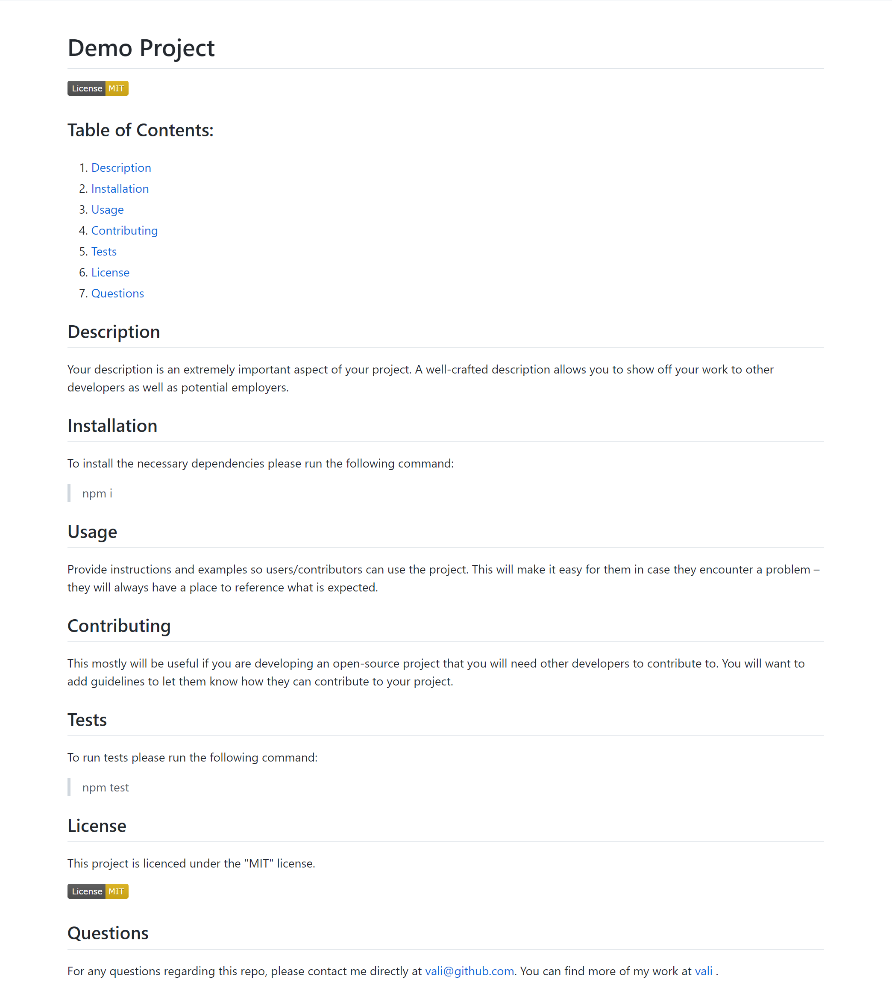

# README-Gen

# Description
The task for this assignment requires to create a command-line application to generate a high-quality README for any app. This should include the app's purpose, how to use the app, how to install it, how to report issues, and how to make contributions.

The command-line application that dynamically generates a professional README.md file from a user's input is built using the <a href="https://www.npmjs.com/package/inquirer">Inquirer package</a>.

This allows the project creator to devote more time to working on the project.

When a user is prompted for information about the application repository, a high-quality, professional README.md is generated with:
- The title of my project
- Sections entitled:
  - Description
  - Table of Contents
  - Installation
  - Usage
  - License
  - Contributing
  - Tests
  - Questions

# Screenshot

# Links
<ul>
  <li>GitHub Repository: https://github.com/valimanea/README-Gen/ </li>
  <li>Video URL: https://drive.google.com/file/d/1vZqDJkCaKxSQxj9iubNGI5djWIgQc7Ex/view </li>
</ul>

